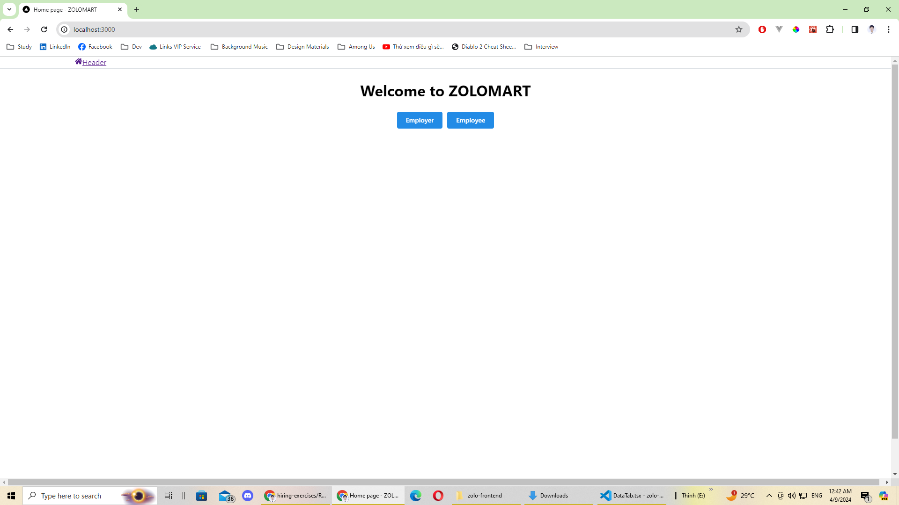
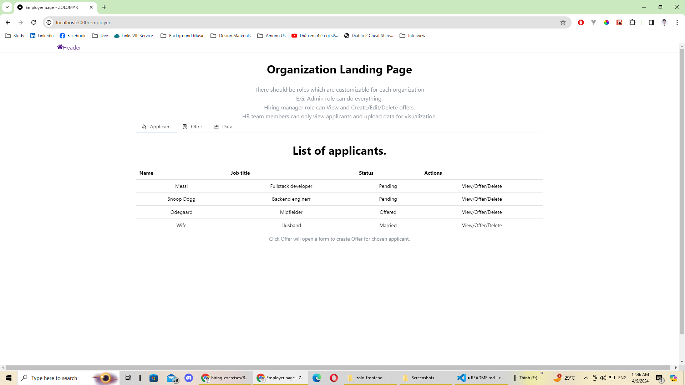
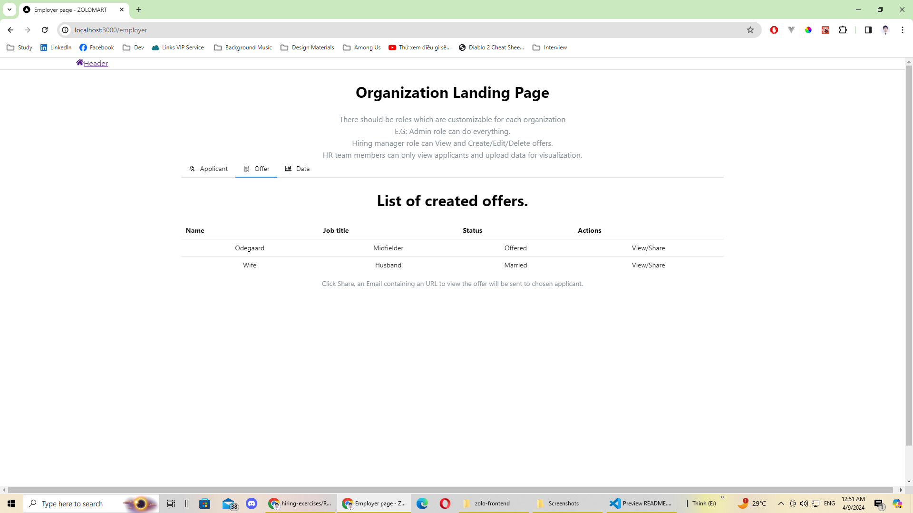
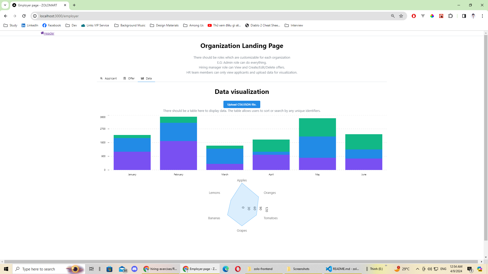
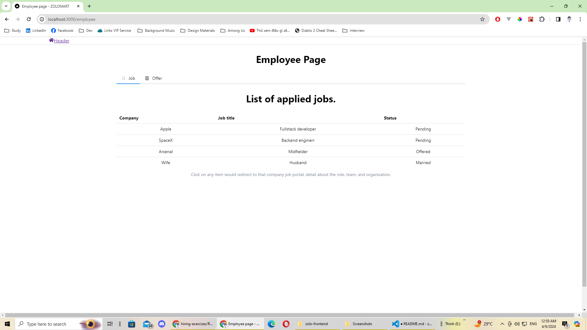
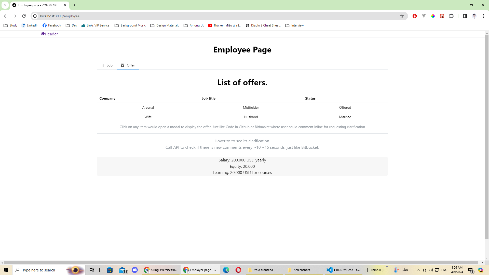

## 1. Show off

### Home page

From here, there are 2 ways to go, choose your path wisely!

### Employer page

#### Applicant Tab (default tab)

- It displays a list of applicants from your organization and provides action buttons.
- Only Admin role and Hiring manager role can be able to create Offers.

#### Offered Tab

- It displays a list of offers that current Admin/Hiring manager created.

#### Data Tab

- It displays a table of data which allows user to sort or search by any unique identifiers.
- It also displays multiple types of charts based on users' desires.
- HR team members can upload CSV/JSON file here.

### Employee page

#### Job Tab (default tab)

- It displays a list of applied jobs.
- Click an item will redirect users to the specific company job portal for more details.

#### Offer Tab

- It displays a list of offers.
- Click an item will open a modal that displays offer details.
- Every offer will have a unique ID and only associated employee can their offers.
- Users can hover over any line and terms to see definitions or clarifications.
- Both employer and employee can make inline comments to the offer just like how Github and Bitbucket work.
- An API will be called every ~10 ~15 seconds to check for new comments.

## 2. My Choice

I chose **frontend** exercise because:

- I consider myself as 60-40, 60 with **frontend**, which means it is my strongest asset.
- I also did read the **backend** exercise, but I feel like I could express my whole idea more with the **frontend**, although I'm willing to try the **backend** later as well.

## 3. My product

When I first read the exercise, I immediately thought of a Hiring and Employment Data Analyst Platform, where:

- Employers can create their own organizations and job postings. They also can create offers for particular employees within the platform. Moreover, they can upload data and visualize them using built-in tools. Last but not least, they can also search for candidates as LinkedIn works.
- Employees need to create accounts to keep track of their employment process. When they are offered, they can view the offers and ask for details or even request changes. They can also create their own profiles for employers to find them.
